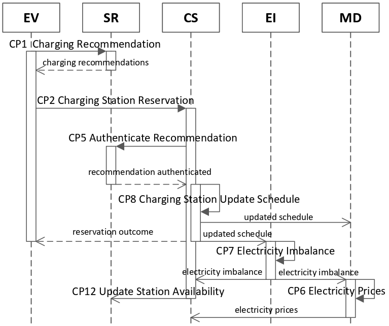
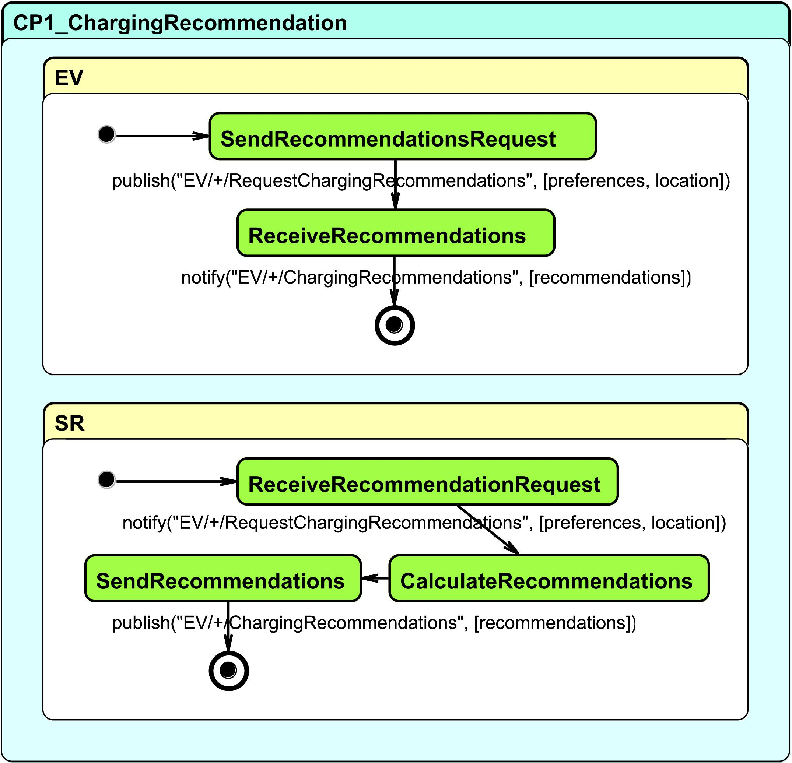
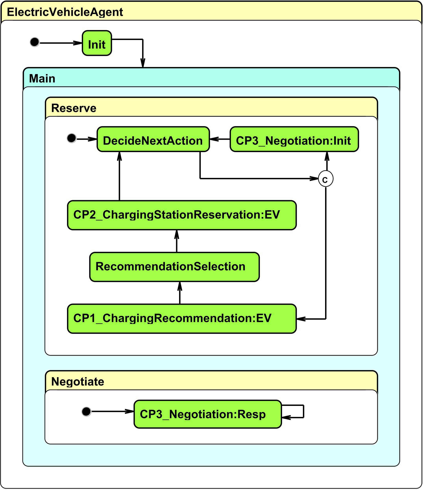
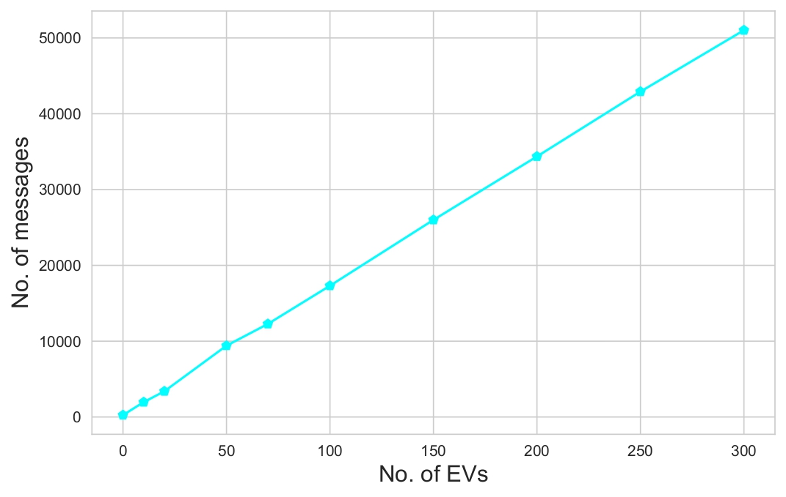

# An Open MAS/IoT-based Architecture for Large-scale V2G/G2V

An open multi-agent systems (MAS) architecture for the important and challenging to engineer vehicle-to-grid (V2G) and grid-to-vehicle (G2V) energy transfer problem domains. 

To promote scalability, our solution is provided in the form of modular microservices that are interconnected using the [SYNAISTHISI](http://iot.synaisthisi.iit.demokritos.gr) multi-protocol Internet of Things (IoT) platform. On the one hand, the low-level modularity of Smart Grid services allows the seamless integration of different agent strategies, pricing mechanisms and algorithms; and on the other, the IoT-based implementation offers both
direct applicability in real-world settings, as well as advanced analytics capabilities by enabling digital twins models for Smart Grid ecosystems. 

Our framework enables the testing of various schemes in simulation mode, and can also be used as the basis for the implementation of real-world prototypes for the delivery of  large-scale V2G/G2V services.

The dataset used for the evaluation can be found [here](https://github.com/iatrakis/IoT-V2G-G2V/tree/main/my_common).

## Related publication
Charilaos Akasiadis, Georgios Iatrakis, Nikolaos Spanoudakis, Georgios Chalkiadakis "An Open MAS/IoT-based Architecture for Large-scale V2G/G2V", in Proceedings of 20th International Conference on Practical Applications of Agents and Multi-Agent Systems (PAAMS'22), L'Aquila Italy, 13th-15th July, 2022 (accepted, to appear).

## Execution Instructions

1. Request access and deploy a local instance of the [SYNAISTHISI platform](http://iot.synaisthisi.iit.demokritos.gr).
2. Create an user and import services and topics metadata [services_metadata.json](./services_metadata.json) via the platform GUI.
3. Upload service files from the respective folders and also "my_common" folder contents in each service-agent.
4. Build and run the agent docker containers via the platform GUI.
5. Publish a message to begin the simulation `mosquitto_pub -h localhost -p 1883 -t timer -i 0 -u <username> -P <password>  -m start`

## Monitoring Simulations and Results

You can access all interim data and results by subscribing to the respective MQTT topics and by creating csv files.
An example python script is given in [data_collector.py](./data_collector.py).
***Please change username and password to your platform credentials.***

## Agent interactions to reserve a charging slot

## Inter agent protocol for receiving charging recomendations

## EV Intra agent protocol

## Number of messages vs number of participating EVs for 10 days period

